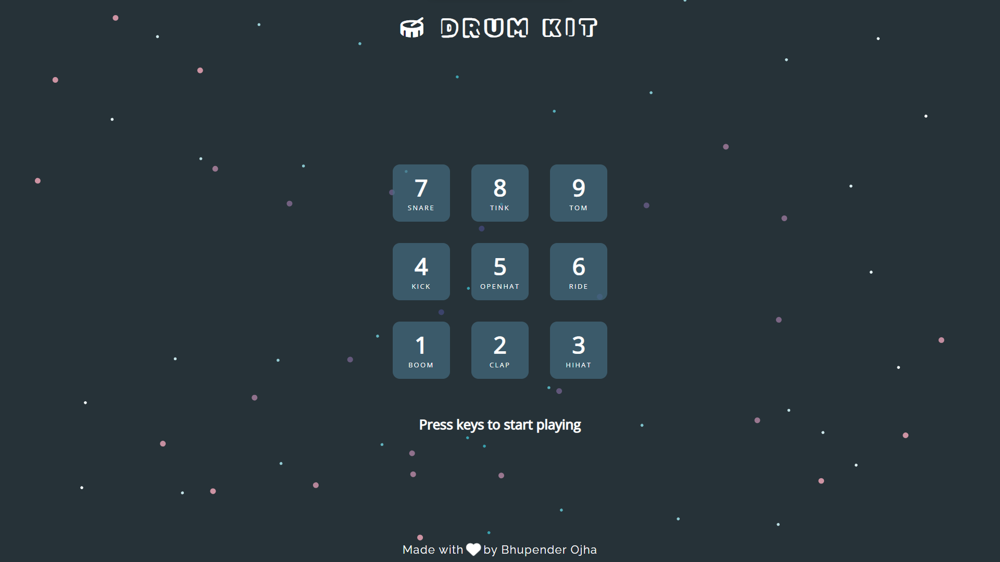

# Drum Kit Application Using JavaScript

Drum Kit is a simple music application where user can play music using the keyboard keys.

This application is created as a part of Wes Bos' "Javascript 30 - 30 Day Vanilla JS Coding Challenge".

Application Link: <https://bhupender-drumkit.netlify.app/>

Application ScreenShot:

